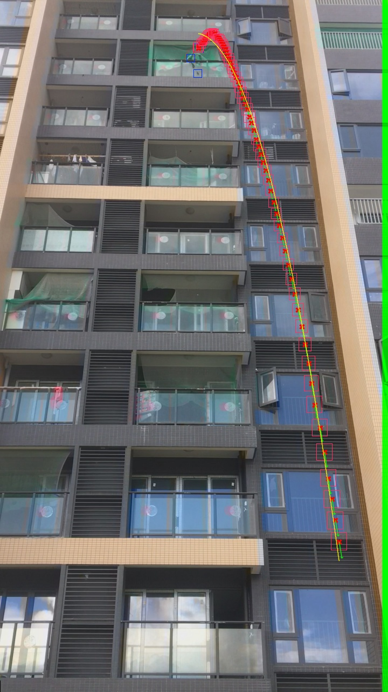

# Falling Object Detection

This is a video analysis system that can detect and track falling objects from a building, based on ViBe background substractor and SORT tracker. It can be deployed on Rockchip embedded platform. Still working in progress.

## Environment
1. x86 Linux/macOS
2. Rockchip ARMv8 Linux

## Dependencies
- [OpenCV](https://github.com/opencv/opencv) 4.5
- [FFMpeg](https://ffmpeg.org) 4.3.1
- [argparse](https://github.com/p-ranav/argparse)
- [Rockchip-RGA](https://github.com/rockchip-linux/linux-rga)

## Demonstration

> Running on EAIDK-310 devboard with RK3228H SoC (Quad core Cortex-A53 1.3GHz)
